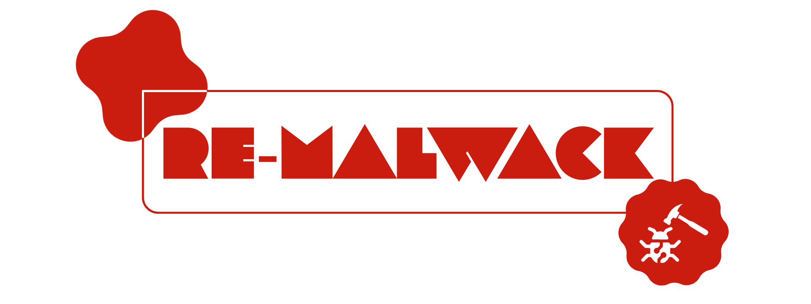

<div align="center">
  

</div>
<h2 align="center">Not just a normal ad-blocker module ✨</h2>

[](https://github.com/ZG089/Re-Malwack/releases/tag/v6.0)
[](https://github.com/ZG089/Re-Malwack/releases)
[](https://xdaforums.com/t/re-malwack-revival-of-malwack-module.4690049/)
[](https://t.me/Re_Malwack)
[](https://t.me/ZGTechs)
[](https://t.me/ZG089)
[](https://xdaforums.com/m/ZG089.11432109/)
[](https://buymeacoffee.com/zg089)


**If you are looking for a final solution to get rid of ads, Malware, and Trackers forever, then Re-Malwack is the best choice for you and your family.**

## Features // What makes this module special?
- ⛔ It blocks ads, malware and trackers By default, you can also block P*rn sites, fake news sites, gambling sites and social sites as well.
- ⚙ Allows you to modify and manage hosts file (whitelist/blacklist urls, reset hosts, auto update adblock)
- 🤙 Allows you to add custom hosts sources, also modify default ones
- ✨ Easy to use
- 🛠 Supports Magisk (v20.0+) (and its variants), KernelSU (and its variants) and Apatch
- 👀 Also can protect [non-root devices](https://github.com/ZG089/Re-Malwack/tree/main?tab=readme-ov-file#3-local-vpn-no-root)
- 🔧 Regularly maintained & updated
- ❤ Made with love and care


## Requirements
> [!IMPORTANT]
> - Stable internet connection.
> - Mid-Range or high-end device.

> [!CAUTION]
> **Do not use this module with any other ad blocker module/app, such as AdAway and Magisk's built-in systemless hosts module.**

## How to use Re-Malwack
> [!TIP]
> - It's not required to use it on terminal if you want to update hosts, by just clicking the action button it will get updated.

### 1. via Terminal
- Type``su -c rmlwk`` terminal to show up the next help message which will clarify how to use it:

```
 "Usage: rmlwk [--argument]"
         "--update-hosts, -u: Update the hosts file."
         "--auto-update, -a <enable|disable>: Toggle auto hosts update."
         "--custom-source, -c <add|remove> <domain>: Add custom hosts source."
         "--reset, -r: Restore original hosts file."
         "--block-porn, -bp <disable>: Block pornographic sites, use disable to unblock."
         "--block-gambling, -bg <disable>: Block gambling sites, use disable to unblock."
         "--block-fakenews, -bf <disable>: Block fake news sites, use disable to unblock."
         "--block-social, -bs <disable>: Block social media sites, use disable to unblock."
         "--whitelist, -w <add|remove> <domain>: Whitelist a domain."
         "--blacklist, -b <add|remove> <domain>: Blacklist a domain."
         "--help, -h: Display help."
```

### 2. Via WebUI
 - Re-Malwack's WebUI can be accesed using [KSU](https://github.com/tiann/KernelSU), [KSUWebUIStandalone](https://github.com/5ec1cff/KsuWebUIStandalone), [Apatch](https://github.com/bmax121/APatch) and [MMRL](https://github.com/DerGoogler/MMRL)

### 3. Local vpn (no-root)
- You can still protect your device without needing for root access, just copy paste this url into [DNSnet](https://play.google.com/store/apps/details?id=dev.clombardo.dnsnet), or [AdAway](https://f-droid.org/packages/org.adaway/), or any other app of your choice :

```
https://raw.githubusercontent.com/ZG089/Re-Malwack/refs/heads/hosts-update/hosts
```
> [!NOTE]
> Hosts source used in the hosts are: StevenBlack, Hagezi Pro+, 1hosts, and AdGuard's DNS, MobileSpyware block and MobileAds block.


## Download Module
> [!TIP]
> - You can download the module from:\
[](https://mmrl.dev/repository/zguectZGR/Re-Malwack)
> - Or from [Releases](https://github.com/ZG089/Re-Malwack/releases/latest) section.


## How does it work? - Frequently Asked Questions (FAQ)

> [!TIP]
> **How does this module block websites and what modifications were made?**
> - How does it block websites: It modifies `hosts` file to block websites and malware by denying access for your phone to connect to it at all. It will just return a blank page.


> [!TIP]
> **Does it blocks in-app ads and in-game ads as well ?**
> - Of course it does! All of this using the magic of magisk and the hosts file !

> [!TIP]
> **My device lags a lot/ there's an error when using the module, How to fix ?**
> - Firstly, export logs, then attach it to your report. Submit [here](https://github.com/ZG089/Re-Malwack/issues) or report your problem in our [telegram support group](https://t.me/Re_Malwack), Just don't forget to attach logs!

> [!TIP]
> **Can I help in something?**
> - Surely, You may suggest features via [Github Issues](https://github.com/ZG089/Re-Malwack/issues) or in our [Telegram support group](https://t.me/Re_Malwack), You may also create your own fork of this repo, do your changes and then do a pull request.

> [!NOTE]
> - For any inquiries or assistance, reach out to me at [XDA](https://xdaforums.com/m/ZG089.11432109/) or [Telegram](https://t.me/ZG089)
> - If you want to reach out to [@person0z](https://github.com/Person0z), contact him using his email: root@person0z.me.

## Activity

 
## Contributors
- [@KOWX712](https://github.com/KOWX712)
- [@GalaxyA14user](https://github.com/GalaxyA14user)
- [@forsaken-heart24](https://github.com/forsaken-heart24)

## This project wouldn't exist without:
- [@person0z](https://github.com/Person0z) - Malwack founder
- [@topjohnwu](https://github.com/topjohnwu) - Magisk Founder
- [@Hagezi](https://github.com/hagezi/dns-blocklists) - Hosts file
- [@hBlock](https://github.com/hectorm/hblock) - Hosts file
- [@StevenBlack](https://github.com/StevenBlack/hosts) - fake news sites and gambling sites blocklist

## Donations
As a 10th-grade student who have to study almost all the time, and at the same time taking care of projects like this, your support would mean the world to me. If you find this module useful, please consider making a small donation using the button below, this will make a difference in my life 😁❤️

[](https://buymeacoffee.com/zg089)
